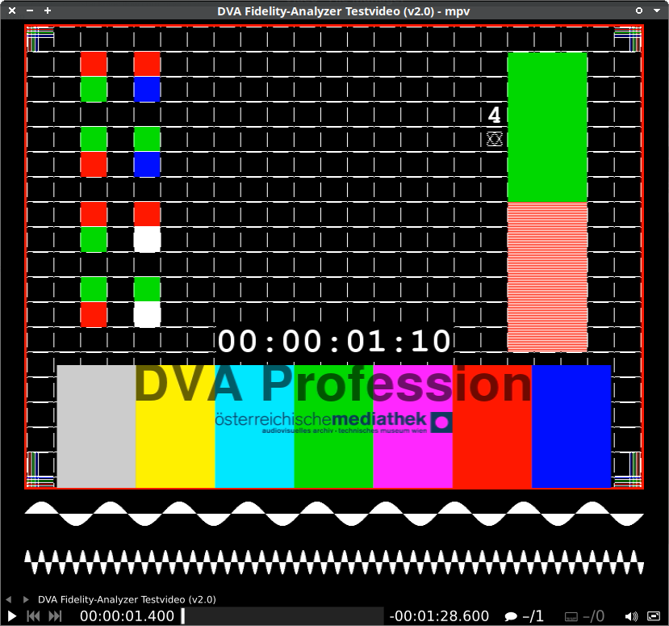

# Overview

AmPv = Archival MPV

This is a collection of settings/code/config for MPV to be used for archival/digitization use cases, like:

  * Quality control (digitization ingest)
  * Frame-precise seeking
  * Audio analysis
  * ...

Some of these modifications are original, some are based on default options that weren't used by default - and others came from existing 3rd party user contributions published online.

# Features

  * Remote control (TCP)
  * Display audio waveform
  * Copy playback position to clipboard
  * Display playback position in millisecond-precision

This player setup is sponsored, and used by the [Austrian Mediathek](https://www.mediathek.at/)

# Relevant Keyboard Shortcuts

  * `.` : Seek 1 frame (forward)
  * `,` : Seek 1 frame (rewind)
  * `;` : Same as `,` - but faster
  * `<ctrl> + <space>` : Copy playback position timecode to clipboard
  * `<alt> + left/right` : Seek 2 seconds reverse/forward
  * `f` : fullscreen
  * `<space>` : playback/pause
  * `I` : (toggle) show technical information (resolution, fps, samplerate, etc)
